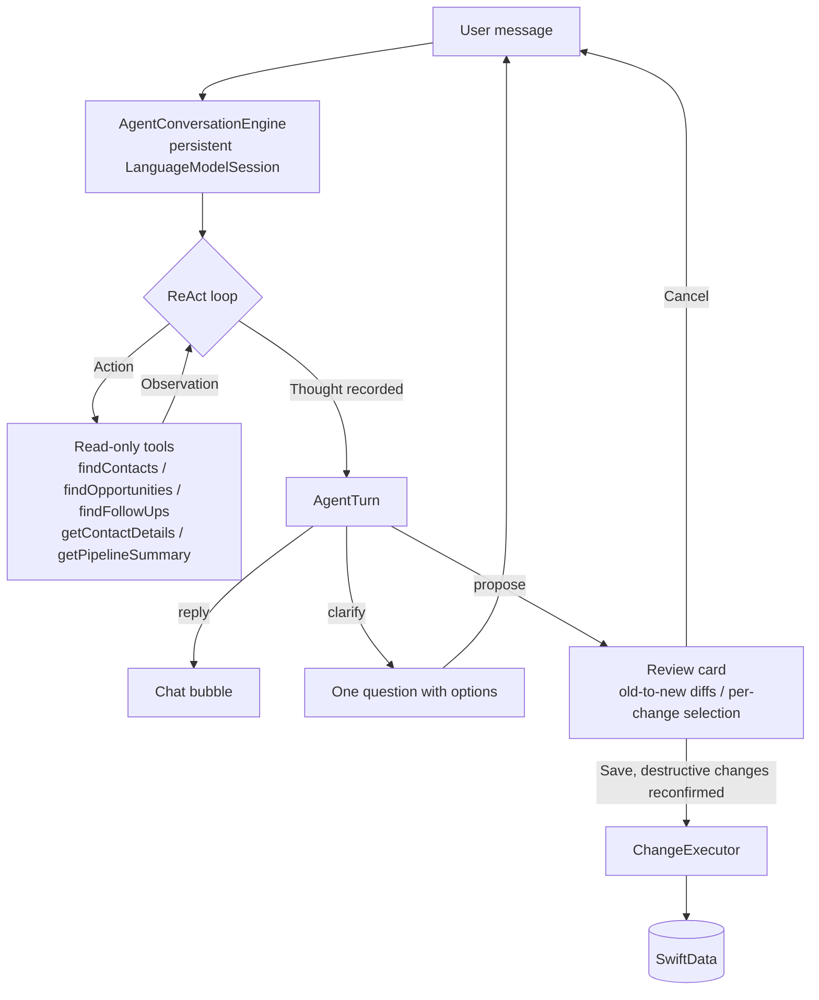

# LeadWhisper

LeadWhisper is a private-first CRM companion for iPhone. It helps freelancers, founders, and small sales teams capture lead updates from natural language, turn them into structured CRM changes, and review everything before it is saved locally.

The app is built around a simple idea: after a call, meeting, or quick thought, you can speak or type what happened. LeadWhisper extracts contacts, opportunities, follow-ups, notes, stages, and activity history, then proposes safe CRM changes you can approve or discard.

## What It Does

- Capture CRM updates by voice or text.
- Review AI-generated drafts before any local data changes are applied.
- Manage contacts, companies, notes, and tags.
- Track opportunities by stage, expected start, budget, and related contact.
- Keep follow-up tasks visible in a Today view.
- Save an activity trail for important changes.
- Load demo data to try ambiguity handling and common CRM flows quickly.

## AI And Privacy

LeadWhisper uses Apple Foundation Models through `FoundationModels` when available on the device. CRM lookups are performed against the local SwiftData store, and the agent can use read-only tools to find matching contacts, opportunities, and follow-ups before proposing changes.

The agent works exclusively with the real local CRM data and never fabricates records. If Apple Foundation Models are unavailable, the agent says so clearly and drafts nothing. Voice input uses Apple's Speech and AVFoundation APIs; on unsupported environments, you can type the transcript instead.

## Agent Architecture

The Agent tab is a small on-device deep agent: the model - not a scripted workflow - decides each turn whether to answer, ask one follow-up question, or propose reviewable CRM changes.



- **One session per conversation.** Follow-up answers are real model turns with full context. On context-window overflow the engine condenses the conversation and retries once.
- **ReAct trace.** Every turn records a thought plus the action/observation sequence. The trace is visible behind a "Details" disclosure on each card, or always with the "Show Agent Reasoning" toggle in Settings.
- **Loop guards.** A per-turn lookup budget and a cap on consecutive clarification rounds keep the loop convergent - the LangChain `max_iterations` and early-stopping ideas applied to Foundation Models.
- **Review before save.** The model only proposes. `ChangeDiffBuilder` resolves the targeted records and shows old-to-new diffs, individual changes can be deselected, and destructive changes require an extra confirmation before `ChangeExecutor` mutates SwiftData.

## App Structure

- `Today`: open follow-ups and recent activity.
- `Contacts`: searchable contact list with linked opportunities and follow-ups.
- `Opportunities`: pipeline grouped by sales stage.
- `Agent`: voice/text composer that prepares local CRM changes.
- `Settings`: data counts, demo data seeding, and local data reset.

## Tech Stack

- Swift 6
- SwiftUI
- SwiftData
- Foundation Models
- Speech and AVFoundation
- XCTest
- [BeamBorder](https://github.com/phillippbertram/BeamBorder) for the animated transcript input border

## Requirements

- Xcode 26.5 or newer
- iOS 26.5 SDK or newer
- iPhone target or iPhone simulator
- Apple Intelligence-capable device for Foundation Models
- Microphone and speech recognition permissions for voice input

Voice recording is intentionally unavailable in the simulator. You can type transcripts there instead; drafting CRM changes requires a device with Apple Intelligence.

## Getting Started

1. Clone the repository.
2. Open `LeadWhisper.xcodeproj` in Xcode.
3. Select the `LeadWhisper` scheme.
4. Choose an iPhone simulator or device.
5. Build and run.

To try the app immediately, open Settings and tap `Load Demo Data`, then use the Agent tab or the floating talk button from the main CRM views.

## Testing

Run the unit tests from Xcode with `Cmd+U`, or from the command line with a simulator destination available on your machine:

```sh
xcodebuild test -project LeadWhisper.xcodeproj -scheme LeadWhisper -destination 'platform=iOS Simulator,name=iPhone 17'
```

## Repository Layout

```text
LeadWhisper/
  App/                  App entry point and root tab navigation
  Core/                 CRM models, repository, logging, and helpers
  Features/             Agent, contacts, opportunities, today, settings, editing
  Resources/            App assets
LeadWhisperTests/       Unit tests for CRM, agent, voice, editing, and utilities
```

## Support

<a href="https://www.buymeacoffee.com/phillippbertram" target="_blank">
  
</a>

<!-- GitHub does not execute script tags in README files, so the image link above is the rendered fallback for this requested button:
<script type="text/javascript" src="https://cdnjs.buymeacoffee.com/1.0.0/button.prod.min.js" data-name="bmc-button" data-slug="phillippbertram" data-color="#FF5F5F" data-emoji="🍺"  data-font="Cookie" data-text="Buy me a beer" data-outline-color="#000000" data-font-color="#ffffff" data-coffee-color="#FFDD00" ></script>
-->

## License

LeadWhisper is available under the MIT License. See [LICENSE](LICENSE) for details.
