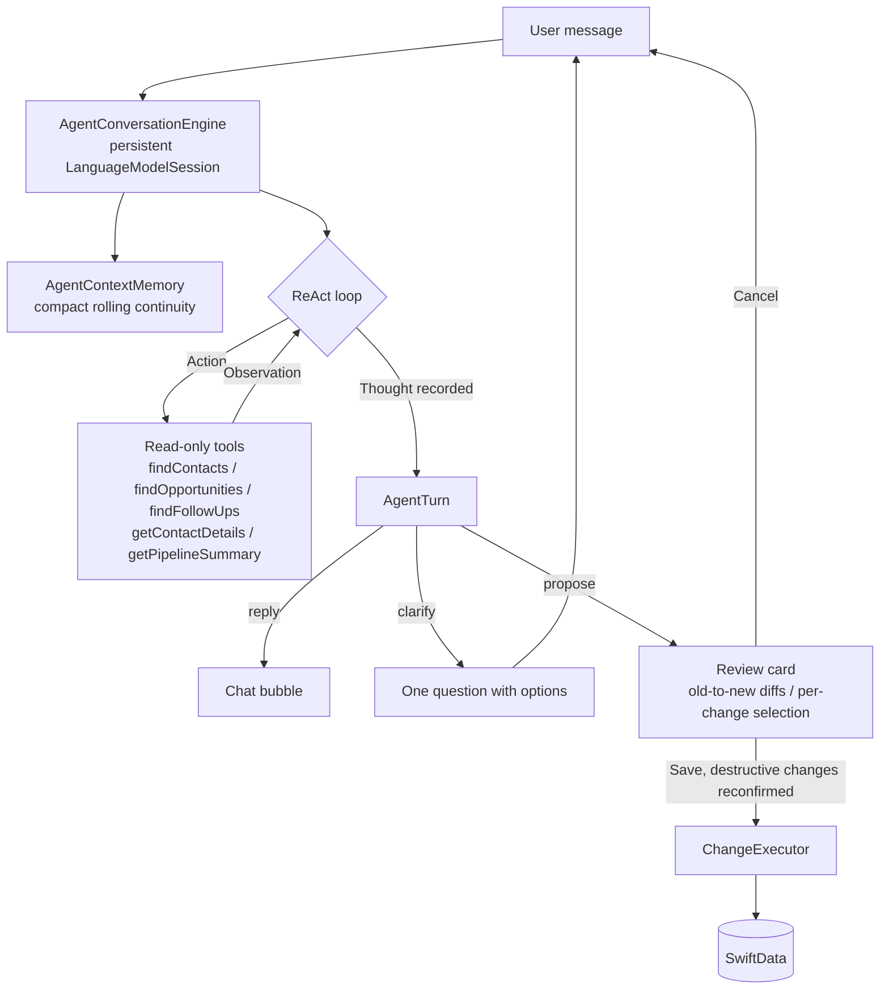

# LeadWhisper

LeadWhisper is a private-first CRM companion for iPhone. It helps freelancers, founders, and small sales teams capture lead updates from natural language, turn them into structured CRM changes, and review everything before it is saved locally.

The app is built around a simple idea: after a call, meeting, or quick thought, you can speak or type what happened. LeadWhisper extracts contacts, opportunities, follow-ups, notes, stages, and activity history, then proposes safe CRM changes you can approve or discard.

## Project Intent

LeadWhisper is also a Swift-native agent experiment. The goal is to find out how far Apple's [Foundation Models](https://developer.apple.com/documentation/foundationmodels) framework can be pushed for a real, local-first productivity workflow without sending private CRM notes, contact names, transcripts, or follow-up context to a custom backend.

Instead of treating the model as a plain text generator, the app uses it as the decision point in an agent loop: it receives compact instructions, can call read-only local CRM tools, returns a structured `@Generable` result, and never writes data directly. The product experience around that loop is just as important as the model call itself: every proposed CRM mutation is shown as a reviewable draft before SwiftData is changed.

The project intentionally stays narrow. A small CRM domain makes it possible to study the hard parts of on-device agents - grounding, tool output size, ambiguity, structured drafts, context pressure, recovery, and human approval - without hiding those problems behind a server-side orchestration layer.

## What It Does

- Capture CRM updates by voice or text.
- Review AI-generated drafts before any local data changes are applied.
- Manage contacts, companies, notes, and tags.
- Track opportunities by stage, expected start, budget, and related contact.
- Keep follow-up tasks visible in a Today view.
- Save an activity trail for important changes.
- Watch Foundation Models context-window usage while composing.
- Load demo data to try ambiguity handling and common CRM flows quickly.

## AI And Privacy

LeadWhisper uses Apple's [Foundation Models](https://developer.apple.com/documentation/foundationmodels) framework through `FoundationModels` when available on the device. CRM lookups are performed against the local SwiftData store, and the agent can use read-only tools to find matching contacts, opportunities, and follow-ups before proposing changes.

The agent works exclusively with the real local CRM data and never fabricates records. If Apple Foundation Models are unavailable, the agent says so clearly and drafts nothing. Voice input uses Apple's Speech and AVFoundation APIs; on unsupported environments, you can type the transcript instead.

## Agent Architecture

The Agent tab is a small on-device deep agent: the model - not a scripted workflow - decides each turn whether to answer, ask one follow-up question, call a local lookup tool, or propose reviewable CRM changes.



- **The context-window problem.** A Foundation Models session has a fixed context window. Apple exposes the limit through [`SystemLanguageModel.contextSize`](https://developer.apple.com/documentation/foundationmodels/systemlanguagemodel/contextsize); LeadWhisper reads it dynamically so the app can adapt to OS, model, or hardware changes. The current on-device budget is small enough that a 4096-token-class window becomes a product constraint, not just an implementation detail. Every instruction, prompt, tool definition, tool output, generable schema, model response, and prior turn consumes part of that window. Long CRM conversations are especially sensitive because read-only lookup tools are useful, but their definitions and observations add token pressure. Once the window is exceeded, the session cannot continue reliably without trimming history or starting fresh with condensed state.
- **Context-window management.** The engine uses the iOS 26.4+ Foundation Models token-count APIs to measure instructions, tools, prompts, the active session transcript, and the `AgentTurn` schema. It keeps a 900-token response reserve separate from the measured context and falls back to a rough estimate if token counting fails. The composer shows a compact progress meter with remaining tokens while the user types or dictates.
- **Compact memory instead of full history.** The session is refreshed after drafts, save/cancel outcomes, overflow recovery, and rolling turns. `AgentContextMemory` carries only recent turns, open clarifications, relevant local IDs, and draft outcomes into the next session.
- **Dynamic tool scope.** The engine attaches only the [tool-calling](https://developer.apple.com/documentation/foundationmodels/expanding-generation-with-tool-calling) definitions that fit the current intent when possible, reducing tool-definition overhead for create flows, pipeline questions, and focused contact/opportunity/follow-up updates.
- **One active model session.** Follow-up answers are real [`LanguageModelSession`](https://developer.apple.com/documentation/foundationmodels/languagemodelsession) turns with compact continuity. On context-window overflow the engine restarts with structured memory and retries once.
- **ReAct trace.** Every turn records a thought plus the action/observation sequence, following the [ReAct pattern](https://arxiv.org/abs/2210.03629) of interleaving reasoning with tool use. The trace is visible behind a "Details" disclosure on each card, or always with the "Show Agent Reasoning" toggle in Settings.
- **Loop guards.** A per-turn lookup budget and a cap on consecutive clarification rounds keep the loop convergent - the LangChain `max_iterations` and early-stopping ideas applied to Foundation Models.
- **Review before save.** The model only proposes. `ChangeDiffBuilder` resolves the targeted records and shows old-to-new diffs, individual changes can be deselected, and destructive changes require an extra confirmation before `ChangeExecutor` mutates SwiftData.

## Lessons And Constraints

Building this in Swift is still much more hands-on than building a comparable server-side agent in Python or TypeScript.

- **Limited community patterns.** Foundation Models is young, and there are fewer examples, blog posts, production write-ups, and battle-tested recipes than for cloud LLM stacks. Many choices in LeadWhisper are therefore first-principles product and systems design rather than "copy the common agent template."
- **No full agent framework in Swift.** Foundation Models provides the model session, guided generation, schemas, token counting, and tools, but it is not a full agent runtime like [LangChain Agents](https://docs.langchain.com/oss/python/langchain/agents) or the [OpenAI Agents SDK](https://openai.github.io/openai-agents-python/). LeadWhisper implements its own harness for loop guards, tool scoping, compact memory, overflow retry, trace display, and human approval.
- **A lot is built from scratch.** The app owns the CRM schema, local lookup tools, tool-output compression, draft validation, diffing, destructive-change confirmation, save/cancel feedback, and context-window recovery. Those are the pieces that hosted agent frameworks often package as middleware or runtime behavior.
- **Few Swift-native LLM options beyond Apple.** There are far fewer mature Swift libraries for working directly with providers such as OpenAI or Anthropic than there are in Python and JavaScript. A production iOS app that uses those providers usually needs its own backend for API-key protection, auth, rate limiting, logging, orchestration, and privacy controls. LeadWhisper avoids that tradeoff by staying on device.
- **The context window changes the product.** Even with compact memory, session refreshes, token counting, and scoped tools, a small on-device context window makes broad, long-running agents difficult. LeadWhisper keeps the agent narrow, keeps tool results short, asks focused clarification questions, and treats every draft as a bounded local task.

## Outlook

The OS 27 betas point toward a more flexible Foundation Models ecosystem. Anthropic's [Claude for Foundation Models](https://platform.claude.com/docs/en/cli-sdks-libraries/libraries/apple-foundation-models) package makes Claude available as a server-side `LanguageModel` provider for Apple's Foundation Models framework, and Apple also documents [`PrivateCloudComputeLanguageModel`](https://developer.apple.com/documentation/foundationmodels/privatecloudcomputelanguagemodel) as another Foundation Models type to watch. In that model, a Swift app can keep using `LanguageModelSession`, guided generation, streaming, structured output, and tool calling while swapping Apple's on-device `SystemLanguageModel` for a hosted or private-cloud-backed model when a task needs larger context, stronger reasoning, image input, or server-side tools.

That direction is promising for LeadWhisper because the app's agent harness is already built around Foundation Models concepts rather than a provider-specific API. A future version could potentially remain local-first by default, then offer an explicit escalation path for larger or more complex CRM turns.

It would also change the privacy and architecture tradeoffs. Anthropic's documentation says requests go directly from the app to the Claude API, not through Apple. For production, the docs recommend a proxy flow instead of shipping an API key in the app binary. So this does not remove the need for backend thinking, but it could make the Swift-side agent code much less bespoke than today's cloud LLM integrations.

## Reference Links

- [ReAct: Synergizing Reasoning and Acting in Language Models](https://arxiv.org/abs/2210.03629)
- [Apple Foundation Models framework](https://developer.apple.com/documentation/foundationmodels)
- [Generating content and performing tasks with Foundation Models](https://developer.apple.com/documentation/foundationmodels/generating-content-and-performing-tasks-with-foundation-models)
- [`LanguageModelSession`](https://developer.apple.com/documentation/foundationmodels/languagemodelsession)
- [`Tool`](https://developer.apple.com/documentation/foundationmodels/tool) and [tool calling](https://developer.apple.com/documentation/foundationmodels/expanding-generation-with-tool-calling)
- [`@Generable`](https://developer.apple.com/documentation/foundationmodels/generable)
- [`SystemLanguageModel.contextSize`](https://developer.apple.com/documentation/foundationmodels/systemlanguagemodel/contextsize)
- [`PrivateCloudComputeLanguageModel`](https://developer.apple.com/documentation/foundationmodels/privatecloudcomputelanguagemodel)
- [LangChain Agents](https://docs.langchain.com/oss/python/langchain/agents)
- [OpenAI Agents SDK](https://openai.github.io/openai-agents-python/)
- [Claude for Apple Foundation Models](https://platform.claude.com/docs/en/cli-sdks-libraries/libraries/apple-foundation-models)

## App Structure

- `Today`: open follow-ups and recent activity.
- `Contacts`: searchable contact list with linked opportunities and follow-ups.
- `Opportunities`: pipeline grouped by sales stage.
- `Agent`: voice/text composer that prepares local CRM changes.
- `Settings`: data counts, demo data seeding, and local data reset.

## Tech Stack

- Swift 6
- SwiftUI
- SwiftData
- Foundation Models
- Speech and AVFoundation
- XCTest
- [BeamBorder](https://github.com/phillippbertram/BeamBorder) for the animated transcript input border

## Requirements

- Xcode 26.5 or newer
- iOS 26.5 SDK or newer
- iPhone target or iPhone simulator
- Apple Intelligence-capable device for Foundation Models
- Microphone and speech recognition permissions for voice input

Voice recording is intentionally unavailable in the simulator. You can type transcripts there instead; drafting CRM changes requires a device with Apple Intelligence.

## Getting Started

1. Clone the repository.
2. Open `LeadWhisper.xcodeproj` in Xcode.
3. Select the `LeadWhisper` scheme.
4. Choose an iPhone simulator or device.
5. Build and run.

To try the app immediately, open Settings and tap `Load Demo Data`, then use the Agent tab or the floating talk button from the main CRM views.

## Testing

Run the unit tests from Xcode with `Cmd+U`, or from the command line with a simulator destination available on your machine:

```sh
xcodebuild test -project LeadWhisper.xcodeproj -scheme LeadWhisper -destination 'platform=iOS Simulator,name=iPhone 17'
```

## Repository Layout

```text
LeadWhisper/
  App/                  App entry point and root tab navigation
  Core/                 CRM models, repository, logging, and helpers
  Features/             Agent, contacts, opportunities, today, settings, editing
  Resources/            App assets
LeadWhisperTests/       Unit tests for CRM, agent, voice, editing, and utilities
```

## Support

<a href="https://www.buymeacoffee.com/phillippbertram" target="_blank">
  
</a>

<!-- GitHub does not execute script tags in README files, so the image link above is the rendered fallback for this requested button:
<script type="text/javascript" src="https://cdnjs.buymeacoffee.com/1.0.0/button.prod.min.js" data-name="bmc-button" data-slug="phillippbertram" data-color="#FFDD00" data-emoji=""  data-font="Cookie" data-text="Buy me a coffee" data-outline-color="#000000" data-font-color="#000000" data-coffee-color="#ffffff" ></script>
-->

## License

LeadWhisper is available under the MIT License. See [LICENSE](LICENSE) for details.
