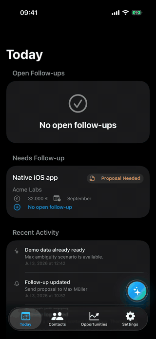
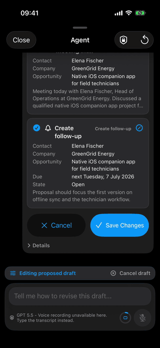
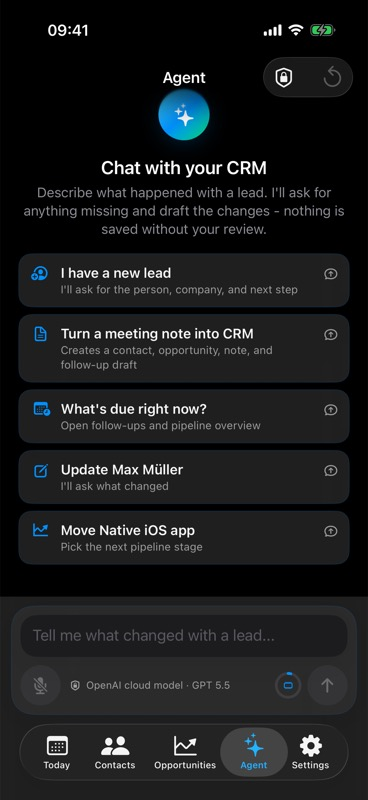
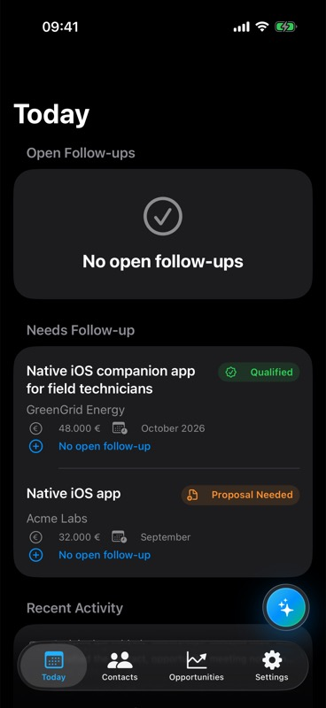
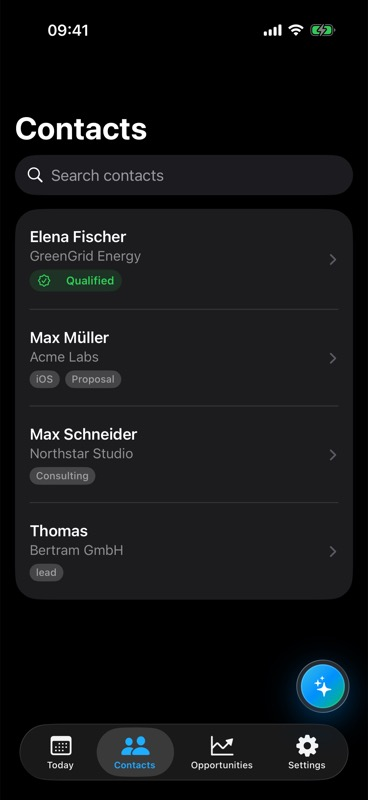
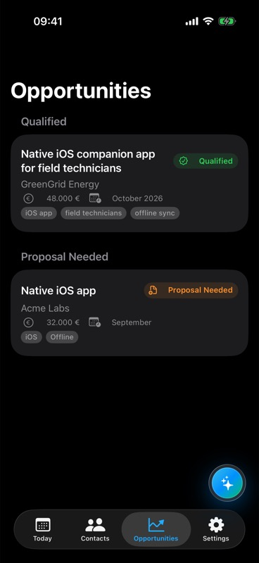
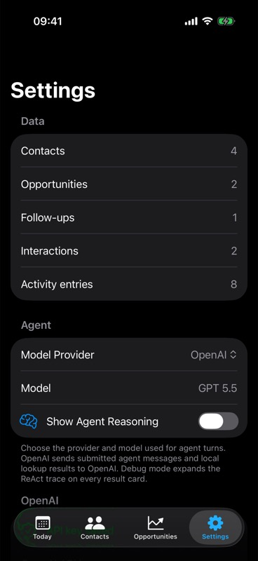
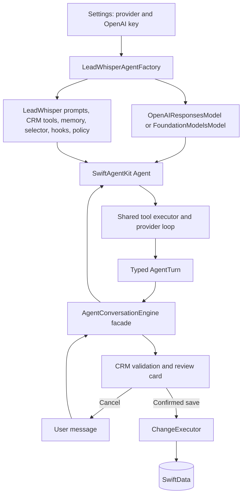

# LeadWhisper

LeadWhisper is an agentic-AI centric CRM showcase for iPhone. The app is built around an internal Swift-native agent that can drive the CRM experience end to end: capture updates, look up local records, answer pipeline questions, draft CRM mutations, and hand every proposed change back to the user for review.

The classic Today, Contacts, Opportunities, and Settings surfaces are still available, but they are not the main idea. The intended interaction model is agent-first: after a call, meeting, or quick thought, you can speak or type what happened and let the internal agent turn that context into reviewed CRM work.

The project started as a private-first, on-device CRM companion. In practice, the current Foundation Models limits make that path too constrained for this agent showcase. The practical path now uses OpenAI for model reasoning while keeping CRM storage, local tools, and review-before-save behavior in the Swift app.

## Showcase Reality Check: Foundation Models Are Not Enough Today

Foundation Models are exciting for on-device experiments, but they are **not suitable for this LeadWhisper showcase today**.

The issue is not the API shape. It is the usable context budget. A CRM agent needs instructions, tool schemas, structured output schemas, tool observations, model responses, and at least a short conversation history. With the current on-device context window, that budget is consumed quickly.

| Question | Short answer |
| --- | --- |
| Why keep Foundation Models at all? | They are useful for learning Apple's native model APIs, token counting, guided generation, and on-device tool calling. |
| Why are they not enough here? | The context window is too small for a richer CRM agent loop with tools, structured drafts, and continuity. |
| What happens in practice? | The agent becomes brittle after only a small amount of instruction, schema, tool output, and history. |
| What is the practical showcase path? | OpenAI gives the agent enough context and model behavior to demonstrate the Swift-native architecture. |
| What is the trade-off? | OpenAI is not private-first: user messages and local CRM lookup results are sent to OpenAI when that provider is selected. |

So the showcase moved up a layer. The interesting question is no longer "can Foundation Models run a full CRM agent on device today?" The practical answer is "not comfortably yet." The interesting question is how much of a useful agent runtime can be built cleanly in Swift around local data, local tools, provider abstraction, and human approval.

## Screenshots

  
  
   
  AgentView interaction
  &nbsp;&nbsp;
  Review interaction

<table>
  <tr>
    <td align="center"> Agent</td>
    <td align="center"> Today</td>
    <td align="center"> Contacts</td>
  </tr>
  <tr>
    <td align="center"> Opportunities</td>
    <td align="center"> Settings</td>
    <td></td>
  </tr>
</table>

## Project Intent

### Swift-native agent harness

LeadWhisper explores what it means to implement an agent natively in Swift instead of wrapping a Python or JavaScript agent runtime.

### Agent-first app model

The Agent tab is not a side feature bolted onto a conventional CRM. It is the center of the app. A user should be able to operate the CRM through the internal agent: create or update contacts, move opportunities, create notes and follow-ups, ask what is due, inspect pipeline state, and then approve or reject the generated local changes.

The surrounding tabs make the local data visible and editable, but the showcase is the agentic workflow itself: natural-language input, local tool use, structured draft generation, and human approval.

The model is not treated as a plain text generator. It acts as the decision point in an agent loop:

- choose whether to answer, ask, use tools, or propose changes;
- call read-only local CRM lookup tools;
- return a structured result;
- leave every write to explicit user review.

### Narrow CRM domain

The app intentionally stays small. A compact CRM domain makes the hard agent problems visible:

- grounding in local data;
- tool output size;
- ambiguity;
- structured drafts;
- context pressure;
- provider boundaries;
- recovery;
- human approval.

### Review before save

The product boundary is simple: the model proposes, SwiftData changes only after review. Every proposed CRM mutation appears as a draft with old-to-new diffs and per-change selection before anything is saved.

## What It Does

- Use the internal agent as the primary interface for CRM work.
- Capture CRM updates by voice or text.
- Review AI-generated drafts before any local data changes are applied.
- Ask agentic questions about follow-ups, contacts, opportunities, and pipeline state.
- Manage contacts, companies, notes, and tags.
- Track opportunities by stage, expected start, budget, and related contact.
- Keep follow-up tasks visible in a Today view.
- Save an activity trail for important changes.
- Switch manually between Apple On-device and OpenAI as the agent provider.
- Store a user-provided OpenAI API key in Keychain for cloud-backed drafting.
- Watch selected-provider context-window usage while composing.
- Load demo data to try ambiguity handling and common CRM flows quickly.

## AI And Privacy

LeadWhisper has two selectable providers:

| Provider | Role in this app | Data boundary | Main limitation |
| --- | --- | --- | --- |
| Apple On-device / Foundation Models | Original private-first experiment | Prompts and tool observations stay on the device | Too constrained for this showcase because the context window is quickly exhausted |
| OpenAI / Responses API | Practical showcase provider | User messages and local CRM lookup results are sent directly to OpenAI | Not private-first; this version has no backend proxy |

### What stays local

- CRM records are stored locally in SwiftData.
- Local lookup tools read contacts, opportunities, and follow-ups before drafting.
- The OpenAI API key is stored in Keychain and is never logged.
- The model never writes directly to SwiftData.

### What leaves the device with OpenAI

When OpenAI is selected, submitted agent messages and local CRM lookup results are sent to OpenAI so the cloud model can draft reviewable changes. There is no backend proxy in this version, so selecting OpenAI explicitly trades away the original private-first model.

### Safety boundary

The remaining safety boundary is product-level, not privacy-level: the agent proposes drafts and never applies changes without review. If the selected provider is unavailable, or OpenAI is selected without a saved key, the app explains the problem and drafts nothing.

Voice input uses Apple's Speech and AVFoundation APIs. On unsupported environments, you can type the transcript instead.

## Agent Architecture

The Agent tab is the app's primary workflow surface. Its reusable runtime now lives in the local [`SwiftAgentKit`](Packages/SwiftAgentKit/README.md) package. The app composes a provider model, prompts, read-only tools, compact memory, tool selection, hooks, and runtime policy from the outside; the SDK has no built-in provider registry.

### Core loop

- `Agent<Output>` owns model invocation, timeout, tool and repeat limits, compact-memory access, context-overflow retry, and lifecycle events.
- `AgentConversationEngine` is an app-facing facade for the local due-overview shortcut, CRM validation, clarification limits, save/cancel feedback, timeline mapping, and review-before-save.
- Apple uses a transient model-generated `AgentToolPlan` with a safe fallback to all read-only tools. OpenAI receives all configured CRM tools and chooses calls within its Responses API roundtrips.
- `AgentSchema` is the single source for `AgentTurn` and tool argument schemas. It becomes strict JSON Schema for OpenAI and `DynamicGenerationSchema` for Apple.
- The shared `AnyAgentTool` executor runs contact, opportunity, follow-up, contact-detail, and pipeline-summary lookups for either provider.

### Provider sessions

- Apple runs the main turn in a [`LanguageModelSession`](https://developer.apple.com/documentation/foundationmodels/languagemodelsession) with planned tools attached.
- OpenAI sends compact memory and tool roundtrips through the Responses API, using Structured Outputs for `AgentTurn`.
- `AgentProviderKind` remains an app UI preference. `LeadWhisperAgentFactory` creates the selected adapter and injects it as `any AgentModel`; switching providers replaces the entire runtime and discards the old provider session and memory.
- OpenAI Keychain access remains app-owned. The adapter only receives an async key provider and model configuration.

### Context management

- A Foundation Models session has a fixed context window exposed through [`SystemLanguageModel.contextSize`](https://developer.apple.com/documentation/foundationmodels/systemlanguagemodel/contextsize).
- LeadWhisper reads that limit dynamically so the app can adapt to OS, model, or hardware changes.
- The engine uses iOS 26.4+ Foundation Models token-count APIs to measure Apple instructions, tools, prompts, transcript, and schema usage.
- OpenAI context usage is estimated locally so draft text is not sent to the network just to count tokens while the user is typing.
- `LeadWhisperAgentMemory` implements the SDK's `AgentMemory` contract and carries only recent turns, open clarifications, relevant local IDs, and draft outcomes into the next turn.

### Trace, guards, and approval

- Every turn records a thought plus the action/observation sequence, following the [ReAct pattern](https://arxiv.org/abs/2210.03629).
- The trace is visible behind a "Details" disclosure on each card, or always with the "Show Agent Reasoning" toggle in Settings.
- A per-turn lookup budget and a cap on consecutive clarification rounds keep the loop convergent.
- `ChangeDiffBuilder` resolves targeted records and shows old-to-new diffs.
- `ChangeExecutor` mutates SwiftData only after the user confirms the selected draft changes.

## Lessons And Constraints

Building this in Swift is still much more hands-on than building a comparable server-side agent in Python or TypeScript:

| Constraint | What it means for LeadWhisper |
| --- | --- |
| Limited community patterns | Foundation Models is young, with fewer examples and production write-ups than cloud LLM stacks. |
| Foundation Models context pressure | The on-device privacy story is compelling, but the hard context limit makes real agent behavior fragile. |
| Young Swift agent ecosystem | `SwiftAgentKit` demonstrates a small native runtime, but it deliberately covers less than [Strands Agents](https://strandsagents.com/), [LangChain Agents](https://docs.langchain.com/oss/python/langchain/agents), or the [OpenAI Agents SDK](https://openai.github.io/openai-agents-python/). |
| Explicit ownership boundary | The SDK owns reusable provider, tool, memory, policy, and hook mechanics. LeadWhisper still owns CRM validation, trace presentation, diffing, destructive confirmation, and approval. |
| Cloud providers change privacy | The V1 OpenAI path is bring-your-own-key and direct from the app to OpenAI. A production app would usually add a backend proxy for credentials, auth, quotas, logging, orchestration, and privacy controls. |

## Outlook

LeadWhisper now composes both providers through the same public `Agent` runtime. A later optional `SwiftAgentKitMacros` target could add `@AgentTool` and `@AgentOutput` code generation while leaving the explicit `AgentSchema` contract underneath; V1 intentionally avoids a SwiftSyntax dependency. On the product side, the next production step would still be replacing the BYO-key path with a proxy that protects credentials, adds auth and quotas, and makes cloud usage auditable.

The OS 27 betas also point toward a more flexible Foundation Models ecosystem. Anthropic's [Claude for Foundation Models](https://platform.claude.com/docs/en/cli-sdks-libraries/libraries/apple-foundation-models) package makes Claude available as a server-side `LanguageModel` provider for Apple's Foundation Models framework, and Apple documents [`PrivateCloudComputeLanguageModel`](https://developer.apple.com/documentation/foundationmodels/privatecloudcomputelanguagemodel) as another Foundation Models type to watch. Both directions could strengthen the Swift-native provider interface and let LeadWhisper keep the same review-before-save harness while adding more provider choices later, but they do not automatically solve privacy, credential, backend, or auditability questions.

## Reference Links

- [ReAct: Synergizing Reasoning and Acting in Language Models](https://arxiv.org/abs/2210.03629)
- [Apple Foundation Models framework](https://developer.apple.com/documentation/foundationmodels)
- [Generating content and performing tasks with Foundation Models](https://developer.apple.com/documentation/foundationmodels/generating-content-and-performing-tasks-with-foundation-models)
- [`LanguageModelSession`](https://developer.apple.com/documentation/foundationmodels/languagemodelsession)
- [`Tool`](https://developer.apple.com/documentation/foundationmodels/tool) and [tool calling](https://developer.apple.com/documentation/foundationmodels/expanding-generation-with-tool-calling)
- [`@Generable`](https://developer.apple.com/documentation/foundationmodels/generable)
- [`SystemLanguageModel.contextSize`](https://developer.apple.com/documentation/foundationmodels/systemlanguagemodel/contextsize)
- [`PrivateCloudComputeLanguageModel`](https://developer.apple.com/documentation/foundationmodels/privatecloudcomputelanguagemodel)
- [OpenAI Responses API](https://platform.openai.com/docs/api-reference/responses)
- [OpenAI Function Calling](https://platform.openai.com/docs/guides/function-calling)
- [OpenAI Structured Outputs](https://platform.openai.com/docs/guides/structured-outputs)
- [Strands Agents](https://strandsagents.com/)
- [LangChain Agents](https://docs.langchain.com/oss/python/langchain/agents)
- [OpenAI Agents SDK](https://openai.github.io/openai-agents-python/)
- [Claude for Apple Foundation Models](https://platform.claude.com/docs/en/cli-sdks-libraries/libraries/apple-foundation-models)

## Tech Stack

- Swift 6, SwiftUI, and SwiftData
- SwiftAgentKit, Foundation Models, and OpenAI Responses API
- Security / Keychain
- Speech and AVFoundation

## Requirements

- Xcode 26.5 or newer
- iOS 26.5 SDK or newer
- iPhone target or iPhone simulator
- Apple Intelligence-capable device for the Apple On-device provider
- OpenAI API key for the optional OpenAI provider
- Microphone and speech recognition permissions for voice input

Voice recording is intentionally unavailable in the simulator. You can type transcripts there instead. Drafting with Apple On-device requires a device with Apple Intelligence; drafting with OpenAI requires selecting OpenAI in Settings and saving an API key.

## Getting Started

1. Clone the repository.
2. Open `LeadWhisper.xcodeproj` in Xcode.
3. Select the `LeadWhisper` scheme.
4. Choose an iPhone simulator or device.
5. Build and run.

To try the app immediately, open Settings and tap `Load Demo Data`, then use the Agent tab or the floating talk button from the main CRM views. Apple On-device is selected by default. To use OpenAI, open Settings, switch the Agent provider to `OpenAI`, and save an API key in the OpenAI section.

### OpenAI API key

For the optional OpenAI provider, create or copy an API key from OpenAI's [API keys page](https://platform.openai.com/settings/organization/api-keys). OpenAI's current guidance is the source of truth; see [Production best practices: API keys](https://developers.openai.com/api/docs/guides/production-best-practices#api-keys).

In the app, open Settings, switch the Agent provider to `OpenAI`, paste the key into the OpenAI section, and save it. LeadWhisper stores the key in Keychain. Do not commit API keys to source code, logs, screenshots, fixtures, or README examples.

## Support

## License

LeadWhisper is available under the MIT License. See [LICENSE](LICENSE) for details.
