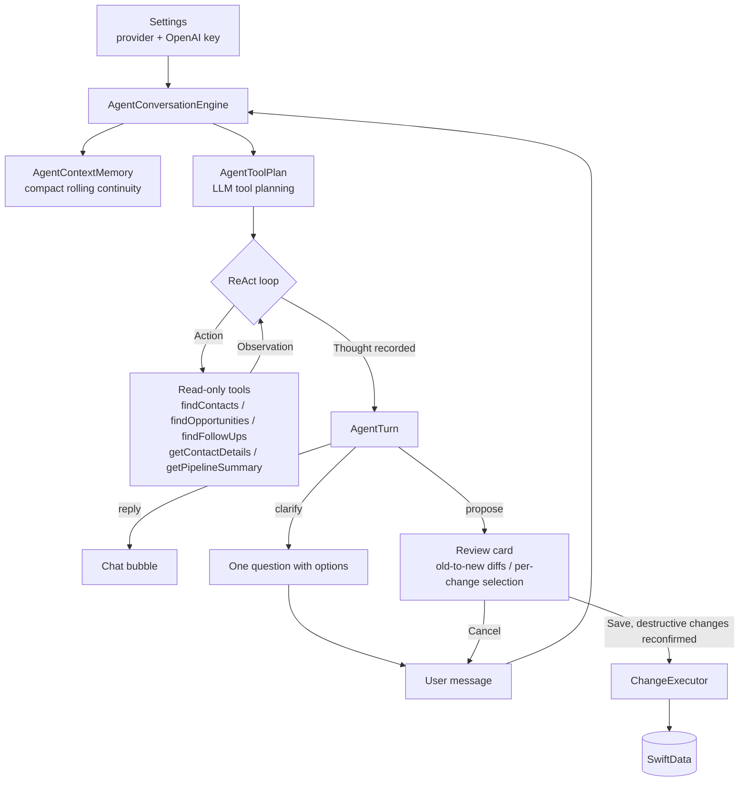

# LeadWhisper

LeadWhisper is a private-first CRM companion for iPhone. It helps freelancers, founders, and small sales teams capture lead updates from natural language, turn them into structured CRM changes, and review everything before it is saved locally.

The app is built around a simple idea: after a call, meeting, or quick thought, you can speak or type what happened. LeadWhisper extracts contacts, opportunities, follow-ups, notes, stages, and activity history, then proposes safe CRM changes you can approve or discard.

## Project Intent

LeadWhisper is also a Swift-native agent experiment. The goal is to find out how far provider-backed LLM agents can be pushed for a real, private-first productivity workflow without giving up local review and user control. The default provider is Apple's on-device [Foundation Models](https://developer.apple.com/documentation/foundationmodels) framework; an explicit OpenAI mode is available for cloud-backed drafting when the user provides an API key.

Instead of treating the model as a plain text generator, the app uses it as the decision point in an agent loop: it receives compact instructions, plans which read-only local CRM tools should be available, can call those tools, returns a structured result, and never writes data directly. The product experience around that loop is just as important as the model call itself: every proposed CRM mutation is shown as a reviewable draft before SwiftData is changed.

The project intentionally stays narrow. A small CRM domain makes it possible to study the hard parts of on-device agents - grounding, tool output size, ambiguity, structured drafts, context pressure, recovery, and human approval - without hiding those problems behind a server-side orchestration layer.

## What It Does

- Capture CRM updates by voice or text.
- Review AI-generated drafts before any local data changes are applied.
- Manage contacts, companies, notes, and tags.
- Track opportunities by stage, expected start, budget, and related contact.
- Keep follow-up tasks visible in a Today view.
- Save an activity trail for important changes.
- Switch manually between Apple On-device and OpenAI as the agent provider.
- Store a user-provided OpenAI API key in Keychain for cloud-backed drafting.
- Watch selected-provider context-window usage while composing.
- Load demo data to try ambiguity handling and common CRM flows quickly.

## AI And Privacy

LeadWhisper can use Apple's [Foundation Models](https://developer.apple.com/documentation/foundationmodels) framework through `FoundationModels` when available on the device, or OpenAI's Responses API when the user selects OpenAI in Settings and saves an API key. The key is stored in Keychain on the device and is never logged.

CRM data remains stored locally in SwiftData. The agent can use read-only tools to find matching contacts, opportunities, and follow-ups before proposing changes. With Apple On-device, model prompts and tool observations stay on the device. With OpenAI, submitted agent messages and local CRM lookup results are sent directly to OpenAI so the cloud model can draft reviewable changes. There is no backend proxy in this version.

The agent works exclusively with the real local CRM data and never fabricates records. If the selected provider is unavailable, or OpenAI is selected without a saved key, the agent says so clearly and drafts nothing. Voice input uses Apple's Speech and AVFoundation APIs; on unsupported environments, you can type the transcript instead.

## Agent Architecture

The Agent tab is a small provider-backed deep agent: the model - not a scripted workflow - decides each turn whether to answer, ask one follow-up question, call a local lookup tool, or propose reviewable CRM changes.



- **Provider abstraction.** `AgentConversationEngine` owns memory, loop guards, draft validation, and review-before-save. Provider clients handle model calls for Apple Foundation Models or OpenAI Responses.
- **The context-window problem.** A Foundation Models session has a fixed context window. Apple exposes the limit through [`SystemLanguageModel.contextSize`](https://developer.apple.com/documentation/foundationmodels/systemlanguagemodel/contextsize); LeadWhisper reads it dynamically so the app can adapt to OS, model, or hardware changes. The current on-device budget is small enough that a 4096-token-class window becomes a product constraint, not just an implementation detail. OpenAI has a larger configured context budget, but tool definitions, tool output, schemas, model responses, and compact memory still count against the selected provider's context.
- **Context-window management.** The engine uses the iOS 26.4+ Foundation Models token-count APIs to measure Apple instructions, tools, prompts, transcript, and schema usage. OpenAI context usage is estimated locally so draft text is not sent to the network just to count tokens while the user is typing. The composer shows a compact progress meter with remaining tokens.
- **Compact memory instead of full history.** The provider session is refreshed after drafts, save/cancel outcomes, overflow recovery, rolling turns, and provider switches. `AgentContextMemory` carries only recent turns, open clarifications, relevant local IDs, and draft outcomes into the next turn.
- **LLM-based tool planning.** Before the main ReAct turn, the selected model returns an `AgentToolPlan` with the smallest safe tool scope: none, contacts, opportunities, follow-ups, pipeline, or full. There are no keyword-based intent lists or local guided workflows; when planning fails, the engine conservatively exposes the full read-only tool set.
- **Provider sessions.** Apple runs the main turn in a [`LanguageModelSession`](https://developer.apple.com/documentation/foundationmodels/languagemodelsession) with planned tools attached. OpenAI sends compact memory and tool roundtrips through the Responses API, using Structured Outputs for `AgentToolPlan` and `AgentTurn`.
- **ReAct trace.** Every turn records a thought plus the action/observation sequence, following the [ReAct pattern](https://arxiv.org/abs/2210.03629) of interleaving reasoning with tool use. The trace is visible behind a "Details" disclosure on each card, or always with the "Show Agent Reasoning" toggle in Settings.
- **Loop guards.** A per-turn lookup budget and a cap on consecutive clarification rounds keep the loop convergent - the LangChain `max_iterations` and early-stopping ideas applied to both providers.
- **Review before save.** The model only proposes. `ChangeDiffBuilder` resolves the targeted records and shows old-to-new diffs, individual changes can be deselected, and destructive changes require an extra confirmation before `ChangeExecutor` mutates SwiftData.

## Lessons And Constraints

Building this in Swift is still much more hands-on than building a comparable server-side agent in Python or TypeScript.

- **Limited community patterns.** Foundation Models is young, and there are fewer examples, blog posts, production write-ups, and battle-tested recipes than for cloud LLM stacks. Many choices in LeadWhisper are therefore first-principles product and systems design rather than "copy the common agent template."
- **No full agent framework in Swift.** Foundation Models provides the model session, guided generation, schemas, token counting, and tools, but it is not a full agent runtime like [LangChain Agents](https://docs.langchain.com/oss/python/langchain/agents) or the [OpenAI Agents SDK](https://openai.github.io/openai-agents-python/). LeadWhisper implements its own harness for provider switching, tool planning, loop guards, compact memory, overflow retry, trace display, and human approval.
- **A lot is built from scratch.** The app owns the CRM schema, local lookup tools, tool-output compression, draft validation, diffing, destructive-change confirmation, save/cancel feedback, and context-window recovery. Those are the pieces that hosted agent frameworks often package as middleware or runtime behavior.
- **Cloud providers change the privacy model.** The V1 OpenAI path is bring-your-own-key and direct from the app to OpenAI. That keeps the app simple for private experimentation, but a production iOS app would usually introduce a backend proxy for API-key protection, auth, rate limiting, logging, orchestration, and privacy controls.
- **The context window changes the product.** Even with compact memory, session refreshes, token counting, and scoped tools, a small on-device context window makes broad, long-running agents difficult. LeadWhisper keeps the agent narrow, keeps tool results short, asks focused clarification questions, and treats every draft as a bounded local task.

## Outlook

LeadWhisper now has the first provider boundary in place: Apple On-device remains the default, and OpenAI can be selected manually for cloud-backed drafting. The next architectural step would be to replace the BYO-key path with a production proxy that protects credentials, adds auth and quotas, and makes cloud usage auditable.

The OS 27 betas also point toward a more flexible Foundation Models ecosystem. Anthropic's [Claude for Foundation Models](https://platform.claude.com/docs/en/cli-sdks-libraries/libraries/apple-foundation-models) package makes Claude available as a server-side `LanguageModel` provider for Apple's Foundation Models framework, and Apple documents [`PrivateCloudComputeLanguageModel`](https://developer.apple.com/documentation/foundationmodels/privatecloudcomputelanguagemodel) as another Foundation Models type to watch. Both directions could let LeadWhisper keep the same review-before-save harness while adding more provider choices later.

## Reference Links

- [ReAct: Synergizing Reasoning and Acting in Language Models](https://arxiv.org/abs/2210.03629)
- [Apple Foundation Models framework](https://developer.apple.com/documentation/foundationmodels)
- [Generating content and performing tasks with Foundation Models](https://developer.apple.com/documentation/foundationmodels/generating-content-and-performing-tasks-with-foundation-models)
- [`LanguageModelSession`](https://developer.apple.com/documentation/foundationmodels/languagemodelsession)
- [`Tool`](https://developer.apple.com/documentation/foundationmodels/tool) and [tool calling](https://developer.apple.com/documentation/foundationmodels/expanding-generation-with-tool-calling)
- [`@Generable`](https://developer.apple.com/documentation/foundationmodels/generable)
- [`SystemLanguageModel.contextSize`](https://developer.apple.com/documentation/foundationmodels/systemlanguagemodel/contextsize)
- [`PrivateCloudComputeLanguageModel`](https://developer.apple.com/documentation/foundationmodels/privatecloudcomputelanguagemodel)
- [OpenAI Responses API](https://platform.openai.com/docs/api-reference/responses)
- [OpenAI Function Calling](https://platform.openai.com/docs/guides/function-calling)
- [OpenAI Structured Outputs](https://platform.openai.com/docs/guides/structured-outputs)
- [LangChain Agents](https://docs.langchain.com/oss/python/langchain/agents)
- [OpenAI Agents SDK](https://openai.github.io/openai-agents-python/)
- [Claude for Apple Foundation Models](https://platform.claude.com/docs/en/cli-sdks-libraries/libraries/apple-foundation-models)

## App Structure

- `Today`: open follow-ups and recent activity.
- `Contacts`: searchable contact list with linked opportunities and follow-ups.
- `Opportunities`: pipeline grouped by sales stage.
- `Agent`: voice/text composer that prepares local CRM changes.
- `Settings`: data counts, demo data seeding, and local data reset.

## Tech Stack

- Swift 6
- SwiftUI
- SwiftData
- Foundation Models
- OpenAI Responses API
- Security / Keychain
- Speech and AVFoundation
- XCTest
- [BeamBorder](https://github.com/phillippbertram/BeamBorder) for the animated transcript input border

## Requirements

- Xcode 26.5 or newer
- iOS 26.5 SDK or newer
- iPhone target or iPhone simulator
- Apple Intelligence-capable device for the Apple On-device provider
- OpenAI API key for the optional OpenAI provider
- Microphone and speech recognition permissions for voice input

Voice recording is intentionally unavailable in the simulator. You can type transcripts there instead. Drafting with Apple On-device requires a device with Apple Intelligence; drafting with OpenAI requires selecting OpenAI in Settings and saving an API key.

## Getting Started

1. Clone the repository.
2. Open `LeadWhisper.xcodeproj` in Xcode.
3. Select the `LeadWhisper` scheme.
4. Choose an iPhone simulator or device.
5. Build and run.

To try the app immediately, open Settings and tap `Load Demo Data`, then use the Agent tab or the floating talk button from the main CRM views. Apple On-device is selected by default. To use OpenAI, open Settings, switch the Agent provider to `OpenAI`, and save an API key in the OpenAI section.

## Testing

Run the unit tests from Xcode with `Cmd+U`, or from the command line with a simulator destination available on your machine:

```sh
xcodebuild test -project LeadWhisper.xcodeproj -scheme LeadWhisper -destination 'platform=iOS Simulator,name=iPhone 17'
```

## Repository Layout

```text
LeadWhisper/
  App/                  App entry point and root tab navigation
  Core/                 CRM models, repository, logging, and helpers
  Features/             Agent, contacts, opportunities, today, settings, editing
  Resources/            App assets
LeadWhisperTests/       Unit tests for CRM, agent, voice, editing, and utilities
```

## Support

<a href="https://www.buymeacoffee.com/phillippbertram" target="_blank">
  
</a>

<!-- GitHub does not execute script tags in README files, so the image link above is the rendered fallback for this requested button:
<script type="text/javascript" src="https://cdnjs.buymeacoffee.com/1.0.0/button.prod.min.js" data-name="bmc-button" data-slug="phillippbertram" data-color="#FFDD00" data-emoji=""  data-font="Cookie" data-text="Buy me a coffee" data-outline-color="#000000" data-font-color="#000000" data-coffee-color="#ffffff" ></script>
-->

## License

LeadWhisper is available under the MIT License. See [LICENSE](LICENSE) for details.
